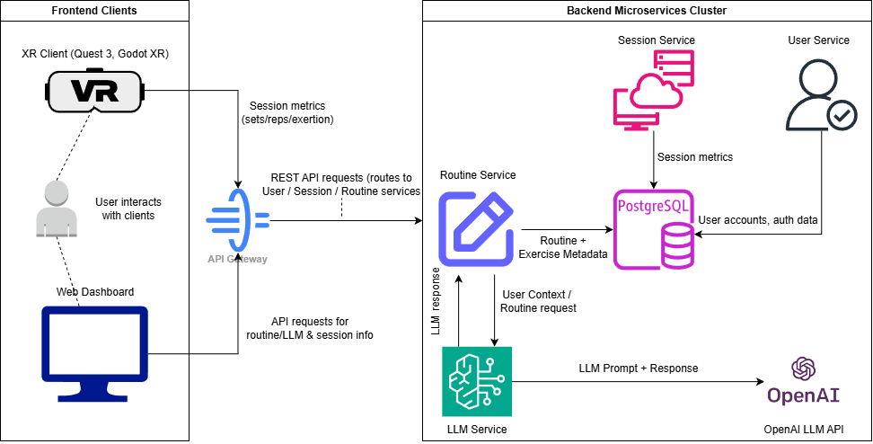
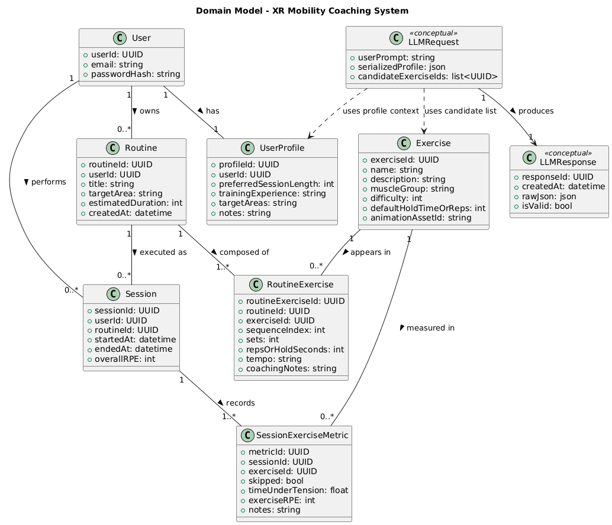
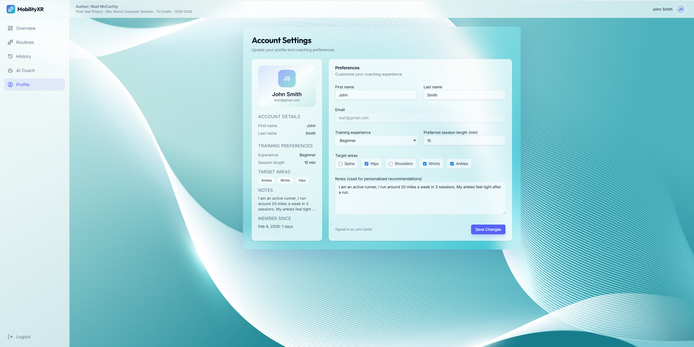
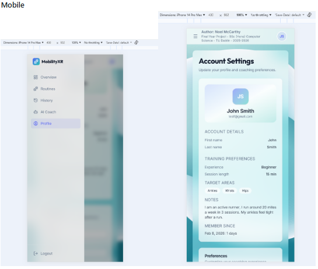
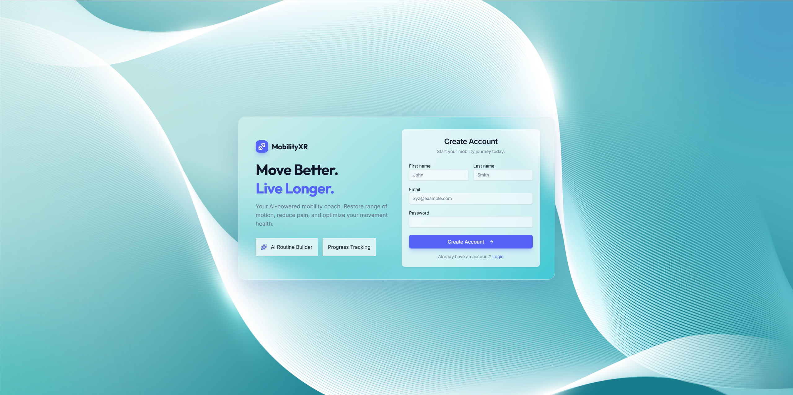
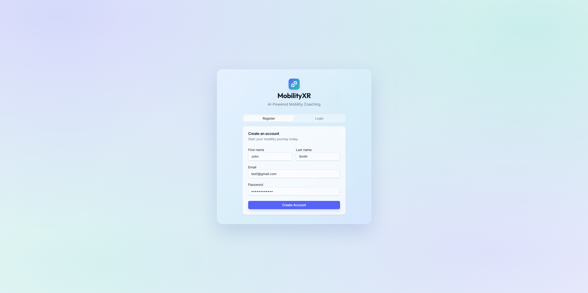
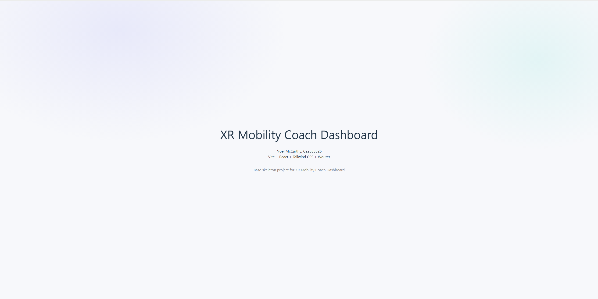

# XR Mobility Coach: An LLM-Powered System for Personalised Home Mobility Training

**Final Year Project – BSc (Hons) Computer Science**  
Technological University Dublin

**Author:** Noel McCarthy  
**Academic Year:** 2025–2026

## Project Overview

XR Mobility Coach is a personalised mobility training platform designed to explore how structured software systems can deliver high-quality guided training without requiring constant in person coaching.

Traditional coaching provides strong guidance but is often limited by cost, accessibility, and scheduling constraints. This project investigates how domain driven software design, conversational AI, and immersive interfaces can translate key elements of structured coaching into a scalable digital system.

Rather than replacing human expertise entirely, the goal is to translate structured coaching workflows into a platform that helps users:

- build personalised training routines
- understand exercises through clear guidance
- track execution history and performance
- interact with AI-assisted planning tools

The system is designed around a multi client architecture where different interfaces support different stages of the training lifecycle.

### Web Dashboard (React + TypeScript)

The primary management interface where users:

- configure their profile and training context
- generate or edit routines using structured LLM workflows
- review session history and performance analytics
- manage exercise programming and progression

The dashboard acts as the planning and analysis layer of the platform. I wanted the user to be able to access a dashboard where they can easily create a routine for themselves, by providing the LLM chat with context about their needs. This solves a common issue for users which is that they typically are unsure of what exercises to do for themselves, and by using a conversational agent, we can receive user context and help personalise a plan for them to follow. E.g., A runner struggles with their ankle mobility, however struggles to find exercises or a routine that fits their needs online. They can open this dashboard, tell the LLM the problem or wants, then receive a routine currated for them to follow and save.

### XR Client (Godot + OpenXR)

An immersive execution environment extending the platform into spatial interaction.

The XR interface focuses on:

- guided routine execution
- multi-angle exercise demonstration
- structured progression through exercises
- recording session metrics for later analysis

XR serves as an extension of the core platform, enabling the user to use an XR headset such as the Meta Quest to load their routines, and perform a mobility session. The session will have a 3D modelled exercise demo for them to follow along with, which will allow the user to observe the exercise from all angles, replay it, pause it etc. to understand it better. This is a signficant cognitive improvement on typical media driven demos, which are 2d or static. Studies have proven that spatial demonstrations improve exercise comphrension.

### Backend API (Java Spring Boot)

A stateless domain centric backend responsible for:

- authentication and user identity
- exercise catalogue management
- routine lifecycle and validation
- session recording and analytics
- orchestration of AI-assisted routine generation

A key architectural principle is the separation between:

- **Exercise catalogue** — immutable reference data
- **User routines** — structured, user-owned training workflows
- **Sessions** — execution history and performance metrics

This separation enables scalable feature development across multiple clients while maintaining clear domain boundaries.

Large Language Models (LLMs) are used as an assistive tool for generating personalised routines based on user context and preferences. The AI does not control the system, suggestions are validated against the backend domain model before being persisted.

This repository is structured as a monorepo containing the XR client, web dashboard, and backend API, allowing the different parts of the system to evolve together while sharing a consistent domain model and development workflow.

## Architecture Overview

XR Mobility Coach is built as a domain driven, multi client platform where all interfaces share a common backend domain model.

Each client focuses on a specific phase of the user workflow:

- Planning and analysis (Web Dashboard)
- Execution and guided interaction (XR Client)

Both consume the same stateless API layer, ensuring consistent behaviour regardless of interface.

<div style="text-align: center;"></div>

### Frontend Clients

#### Web Dashboard

- User onboarding and profile configuration
- LLM assisted routine creation and editing
- Session history and analytics visualisation

#### XR Client

- Guided execution of training sessions
- Interactive exercise demonstrations
- Local tracking of performance metrics
- Submission of completed session data

---

### Backend Domain Services

The backend acts as the orchestration layer for the entire system:

- Stateless JWT-based authentication
- User profile management
- Exercise catalogue queries
- Routine lifecycle management
- Session recording and analytics capture
- LLM orchestration using schema-constrained generation

---

### Data Layer

PostgreSQL provides structured persistence for:

- User identities and profiles
- Exercise reference data
- User defined routines
- Historical session performance metrics

---

## Domain Model

The system is designed around a shared domain model that defines how training concepts relate to one another. This model acts as the single source of truth across all clients and backend services.

<div style="text-align: center;"></div>

Key entities include:

- **User** — identity and ownership of routines and sessions
- **UserProfile** — contextual data used for personalisation
- **Exercise** — curated reference catalogue
- **Routine** — structured training workflows
- **RoutineExercise** — ordered exercise composition
- **Session** — execution instance of a routine
- **SessionExerciseMetric** — recorded performance data
- **LLMRequest / LLMResponse** — conceptual modelling of AI-assisted generation

Separating reference data, planning structures, and execution history enables scalable feature development while maintaining clear domain boundaries.

---

## Status

This project is under active development. See change logs below.

## Local Setup

This repository contains three main application areas:

- `xr-mobility-coach-api` - Spring Boot backend
- `xr-mobility-coach-web` - React + Vite web dashboard
- `xr-mobility-coach-headset` - Godot XR client

### Prerequisites

- Java 17
- Node.js 20+
- npm
- Docker Desktop
- Godot 4.x

### 1. Start the local database

From the repository root:

```bash
docker compose -f infra/docker-compose.yml up -d
```

This starts the local PostgreSQL development database used by the backend.

### 2. Run the backend

The backend lives in `xr-mobility-coach-api`.

Use a local Spring profile and provide local-only config values outside of version control.

Local development expects:

- PostgreSQL at `localhost:5433`
- a local JWT secret
- CORS allowed for `http://localhost:5173`

Run the API with the `local` profile enabled.

Linux / macOS:

```bash
cd xr-mobility-coach-api
./mvnw spring-boot:run -Dspring-boot.run.profiles=local
```

Windows PowerShell:

```powershell
cd xr-mobility-coach-api
.\mvnw.cmd spring-boot:run "-Dspring-boot.run.profiles=local"
```

The backend runs on `http://localhost:8080`.

### 3. Run the web dashboard

The frontend lives in `xr-mobility-coach-web`.

```bash
cd xr-mobility-coach-web
npm install
npm run dev
```

The dashboard runs on `http://localhost:5173`.

During local development, `/api` requests are proxied to the Spring Boot backend.

### 4. Run the XR client

Open `xr-mobility-coach-headset` in Godot and run the project from the editor.

The headset client is still under active development and may require local device-specific XR configuration depending on your setup.

# Change logs

Below is each pull request summarised, seperated into the XR Client, Web Client, and Backend Client changes.

# Web Client: `xr-mobility-coach-web`

## (PR#10): feature: create profile page to support get/put APIs, build app layout, header, and sidebar UI, with mobile support

https://github.com/NQ-TU/xr-mobility-coach/pull/10

In this PR we introduce the application layout and initial profile management flow for our web frontend.

It establishes the core application 'shell' used across our authenticated routes (internal pages after auth), including a sidebar, header, and shared layout components. Mobile devices are supported with a 'hamburger' style dropdown for the sidebar.

It also introduces the Profile page, enabling users to view and update their account and coaching preferences via the backend profile APIs.

<div style="text-align: center;"></div>
<div style="text-align: center;"></div>

#### Application Layout

- `AppLayout` wrapper for authenticated routes
- Persistent sidebar navigation (Overview, Routines, History, AI Coach, Profile)
- Header with user identity display and global search
- Consistent glass UI styling aligned with auth page

#### Profile Page

- New `/profile` route
- Fetch user profile via `GET /api/profile/me`
- Update profile via `PUT /api/profile/me`
- Editable fields:
  - First / Last name
  - Training experience
  - Preferred session length
  - Target areas
  - Notes

- Live profile preview card showing user summary

## (PR#9): Feature/web auth redesign

https://github.com/NQ-TU/xr-mobility-coach/pull/9

In this PR I redesigned the authentication page, from a single column login/register card to a two column design, alongside updating the background.

I believe this gives the UI a more polished look, along with providing more user context. The background update also takes advantage of the 'frosted glass' design I am trying to achieve. The previous background was a gradient, which the frosted glass worked with but wasn't as obvious. I think this is a significant improvement.

<div style="text-align: center;"></div>

#### Notes

- Updated backend `UserProfileController.java` logging to reflect new `user_profiles` columns.
- Updated index.html to reflect frontend assets more consistently, specifically the logo and title.

## (PR#8): feature: add auth flow & foundation (wouter, protected routes, api client), glass UI styling, profile upsert on register

https://github.com/NQ-TU/xr-mobility-coach/pull/8

Implements the initial authenticated web dashboard flow for XR Mobility Coach.

Users can register/login via the Spring Boot API, the client stores the JWT, protects app routes, and redirects unauthenticated users to `/auth`. On registration, we also upsert the user's profile to persist first/last name.

<div style="text-align: center;"></div>

#### Features Added

- Auth page UI (Login / Register tabs)
- Typed API client wrapper with `Authorization: Bearer <token>`
- `AuthContext` provider (`login`, `register`, `logout`, `me`)
- `ProtectedRoute` guard (redirects unauthenticated users to `/auth`)
- Minimal protected page shell (`/overview`)
- Profile upsert on register (`PUT /api/profile/me`) to store first/last name
- Glass / gradient styling foundation (Tailwind)

## (PR#6): feature: scaffold XR Mobility Coach dashboard (Vite, React, TypeScript, Tailwind, Wouter)

https://github.com/NQ-TU/xr-mobility-coach/pull/6

This PR introduces the initial frontend scaffold for the XR Mobility Coach dashboard application.

The frontend has been migrated from a static HTML/Bootstrap prototype to a modern React based architecture to support scalable UI development, improve state management, and integration with the Spring Boot API. Feedback was received to create a good UI, especially for presentation so I have decided to use a more appropriate tech stack. Aiming to have a 'glassmorphism' look to the dashboard.

`npm run dev`

<div style="text-align: center;"></div>

#### Tech Stack

- Vite: build tool / dev server.
- React + TypeScript
- TailwindCSS: Styling
- Wouter: Client side routing

#### Notes

- Base React/Vite project setup
- Dev API proxy configured for Spring Boot backend (`/api -> localhost:8080`)
- I used the following commands to generate this baseline project template
  - `npm create vite@latest xr-mobility-coach-web -- --template react-ts`
  - `npm install`
  - `npm install -D tailwindcss @tailwindcss/vite postcss autoprefixer`
  - `npm install tw-animate-css`
  - `npm install wouter`

---

# Backend: `xr-mobility-coach-api`

#### Tech Stack

- Spring Boot 3.5.10 + Java 17 + JPA + Flyway + PostgreSQL, JWT via OAuth2 resource server.

## (PR#7): Feature/update user_profiles with firstName & lastName to support frontend registration

https://github.com/NQ-TU/xr-mobility-coach/pull/7

This PR extends the user profile domain to support first and last name fields, enabling richer metadata and aligning the backend data model with frontend registration requirements.

#### Features added

- Added firstName and lastName to user profile table
- Updated DTOs
- Extended service layer to support
- Flyway migration to add profile name columns
  - Added missing flyway version file too

## (PR#5): feature: add session creation endpoint with per exercise metrics capturing for XR completed routines

https://github.com/NQ-TU/xr-mobility-coach/pull/5

This PR introduces the session metrics capture layer for the XR mobility coach backend.

It enables the XR client to submit a single completed session payload with per exercise performance data, forming the foundation for:

- End to end XR functionality now possible.
- Session history & analytics tracking including user progress tracking

#### Features added

- `POST /api/sessions` - record a completed session with metrics
- Session + metric persistance (`sessions`, `session_exercise_metrics`)
- Routine ownership validation (JWT user must own routine)
- Exercise existence validation for metrics
- Basic payload validation (timestsamps, duplicate setIndex, skips/completed constraints)
- DTO request/response boundaries

#### Domain Model

`Session`

- Represents a completed XR routine execution
- Linked to a user and routine
- Stores timestamps + overall RPE

`SessionExerciseMetric`

- Links a Session to Exercise catalogue exercise
- Captures setIndex, reps, time under tension, RPE, notes etc.

`Exercise`

- Immutable catalogue reference entity

#### API Design Notes

- XR client posts one payload at session end (no start endpoint required)
- startedAt/endedAt provided by XR client
- routineId required and must belong to user
- setIndex is 1‑based (no 0)
- Metrics validated for duplicates and invalid exercise IDs

## (PR#4): feature: implementing user owned routine management, create/update/delete, DTO response/request, ordered sequence, expose 5 endpoints

https://github.com/NQ-TU/xr-mobility-coach/pull/4

This PR introduces the routines domain layer as part of the XR Mobility Coach backend architecture.

The routines module establishes a user owned structured exercise workflow that serves as the core execution model for:

- XR guided sessions
- Session tracking and analytics
- AI generated routine personalization

This aligns with the layered architecture separating:

- Exercise catalogue (reference data)
- User routines (mutable domain state)
- Sessions (execution history)

#### Features added

- `GET /api/routines?page=0&size=10&sort=createdAt,desc` - get paginated list of routines
- `GET /api/routines/{id}` - get routine details for specific routine
- `POST /api/routines` - Create routine
- `PUT /api/routines/{id}` - Update existing routine
- `DELETE /api/routines/{id}` - Delete a routine
- Service layer validation
- Ownership enforced via JWT
- DTO request/response boundaries#
- Exercise must exist in DB for create/update
- Enforces our exercise catalogue

#### Domain Model

`Routine`

- Represents a user owned mobility workflow
- Contains ordered list of RoutineExercise items

`RoutineExercise`

- Links a Routine to Exercise catalogue entries
- Maintains sequenceIndex for deterministic ordering
- Stores execution metadata (sets, tempo, reps/hold etc)

`Exercise`

- Immutable catalogue reference entity

#### API Design Notes

- Exercises remain read only catalogue data
- Routines are fully user owned resources
- DTOs used to maintain separation between persistence and API contracts
- Pagination implemented using Spring Pageable

## (PR#3): feature: Adding exercise DTOs, pageable exercise API addition, provides exercise catalogue functionality

https://github.com/NQ-TU/xr-mobility-coach/pull/3

This PR introduces our exercise DTO, service, repository and controller.

This establishes the functionality for our exercise catalogue, which will be used to populate routines later.

#### Features added

- `GET /api/exercises` - return from exercise table
  - 20 record limit set through `@PageableDefault(size = 20, sort = "name") Pageable pageable)`
- `GET /api/exercises?q=curl&muscleGroup=Spine` - Allows for partial search & by muscleGroup filters
  - Search parameters we will want in Routine builder page.
- Stateless, JWT authenticated access (reuses existing security config)
- DTO based request / response boundaries
- Logging for filtered requests

#### Notes

- This endpoint is intentionally read only: exercise addition will be managed by migrations to ensure catalogue consistency, keeping purely metadata available that coincides with our XR exercise catalogue, rather than runtime CRUD.
- Pagination is implemented server side using Spring Pageable to ensure scalability and avoid loading large datasets into memory

## (PR#2): feature: Add authenticated user profile API with lazy creation

https://github.com/NQ-TU/xr-mobility-coach/pull/2

This PR introduces an authenticated **user profile API** to the backend.

It adds a 1:1 user profile model that is **lazily created on first access**, allowing clients to retrieve and update user specific preferences without requiring explicit profile creation during registration.

This establishes the foundation for user personalisation and future XR / LLM-driven features.

#### Features added

- `GET /api/profile/me` - retrieve the authenticated user’s profile
  - Automatically creates an empty profile if one does not exist
- `PUT /api/profile/me` - create or update the authenticated user’s profile (upsert)
- One-to-one `UserProfile` entity linked to authenticated users
- Stateless, JWT authenticated access (reuses existing security config)
- JPA managed `createdAt` and `updatedAt` timestamps
- DTO based request / response boundaries
- Domain level logging for profile access and updates

#### Notes

- Profiles are **created lazily** on first access to reduce coupling with registration
- The `PUT /me` endpoint is implemented as an **upsert** (create or update)
- No additional security configuration was required, existing JWT enforcement applies
- Profile data is fully owned by the authenticated user (no cross user access)
- Logging avoids sensitive data and focuses on domain level events

## (PR#1): feature: implemented stateless JWT auth with register/login/me endpoints and secure API

https://github.com/NQ-TU/xr-mobility-coach/pull/1

This PR introduces stateless JWT-based authentication to the backend API.

It enables user registration, login, and authenticated user identity retrieval, and secures all non-auth endpoints by default.

#### Features added

- `POST /api/auth/register` – create a new user account
- `POST /api/auth/login` – authenticate and receive a JWT access token
- `GET /api/auth/me` – retrieve the authenticated user identity
- Stateless JWT authentication (HS256)
- All non-auth endpoints protected (401 without token)
- JWT signing secret externalised via environment variable (`JWT_SECRET`)

#### Notes

- No server side sessions are stored, logout will be handled client side by discarding the token
- Token expiry is enforced via JWT exp claim
